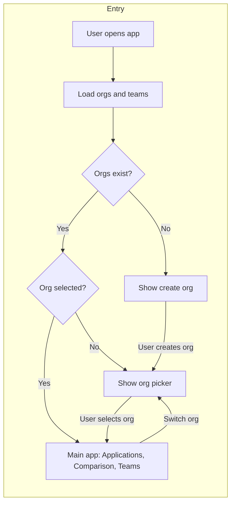

# Organization-first entry point – Plan (with docs and tests)

## Overview

Make the app entry point organization-centric: when the user opens the app they first select (or create) an organization, then all main views (Applications, Comparison, Teams, Docs) show data within that organization. Optional URL persistence allows direct links to an org. **All related documentation and tests must be created or updated.**

---

## 1. Frontend: entry and "no org selected" state ([public/app.js](public/app.js))

- **Initial view logic**
  - If `selectedOrganizationId` is null and `organizations.length > 0`: show an **organization picker** as the main content (not the Applications tab).
  - If `selectedOrganizationId` is null and `organizations.length === 0`: show the **Organizations** view (create first org).
  - If `selectedOrganizationId` is set: show the existing main nav (Applications, Organizations, Comparison, Teams, Docs) and content, all scoped to that org.

- **Stop auto-selecting first org on load.** In `loadOrganizations`, remove the line that sets `selectedOrganizationId` to the first org when it is null.

- **Organization picker UI**: New block when `!selectedOrganizationId && organizations.length > 0`: title "Select an organization", list or grid of orgs with "Open" / "View" that sets `selectedOrganizationId(org.id)` and optionally `setView("applications")`. Optional: show per-org summary (e.g. application count).

- **Shell / context**: When an org is selected, show current organization name prominently. Add "Switch organization" that clears `selectedOrganizationId` so the user returns to the picker.

## 2. Frontend: scope all main views to selected org

- **Applications**: Already uses `selectedOrganizationId`. Ensure no applications are shown without an org.
- **Comparison**: Uses `applications` state (already org-scoped). No change needed.
- **Teams**: Optionally filter teams to current org (e.g. from list response or new `GET /api/teams?organizationId=`).

## 3. Optional: URL persistence

- Read `organizationId` from query on load; if valid, set `selectedOrganizationId`.
- When `selectedOrganizationId` changes, update URL (e.g. `history.replaceState`). When switching to "no org," remove the param.
- If URL has invalid org id, clear it and show the picker.

## 4. Backend (optional, for team scoping)

- If scoping Teams by org: add `GET /api/teams?organizationId=xxx` in [src/routes/teamRoutes.ts](src/routes/teamRoutes.ts) and filter in [teamRepository](src/repositories/teamRepository.ts) / [teamService](src/services/teamService.ts).

---

## 5. Documentation

All related docs must be created or updated.

### 5.1 [README.md](README.md)

- **User Interface (around lines 7–42):**
  - Update intro to say the app starts with **organization selection**: users first choose (or create) an organization, then see applications, comparison, and teams for that org.
  - Add a short subsection describing the **organization picker** (first screen when orgs exist but none selected) and **Switch organization** (return to picker).
  - Keep or update screenshots: if a new "organization picker" screenshot is added, reference it (e.g. "Select an organization" view).
- **API section (around lines 107–115):**
  - Clarify that the **UI** is organization-first: users work in the context of a selected organization; list endpoints already support `?organizationId=` where applicable.
  - If `GET /api/teams?organizationId=` is added, document it in the Teams bullet.
- **Integrations:** ServiceNow prerequisite already says "create at least one organization"; no change required unless the sync behavior changes (e.g. which org is used when none is "selected" in the UI).

### 5.2 [ARCHITECTURE.md](ARCHITECTURE.md)

- **Data flow / model (around line 47):**
  - Update the "Organization-scoped model" and "Application-first" sentence to: **Organization-first entry:** The UI entry point is selecting an organization; all main views (Applications, Comparison, Teams) are then scoped to that organization. Applications are the primary entity within an org; each application has a required `organizationId`. (Keep the rest of the paragraph as-is.)
- **Where to change what:** No new rows required unless team filtering by org is added (then note "Filter teams by organization" in `routes/teamRoutes.ts` and `repositories/teamRepository.ts`).
- **Tests:** Optional one-line note that the frontend entry flow (organization picker) is covered by manual or E2E testing if applicable.

### 5.3 New or updated user-facing docs (optional)

- If the project maintains **how-to** or **user guide** docs (e.g. under `docs/`), add or update:
  - **How to get started:** Open the app → select or create an organization → then add applications, run assessments, compare, and manage teams within that org.
  - **How to switch organization:** Use "Switch organization" in the app to return to the organization list and pick another org.

---

## 6. Tests

All related tests must be created or updated.

### 6.1 New tests

- **Organization service ([src/services/organizationService.ts](src/services/organizationService.ts)):**  
  Create **`src/services/organizationService.test.ts`** (currently missing). Cover:
  - `list()`: returns organizations from repository.
  - `getById(id)`: returns org when found; throws "Organization not found" when repository returns null.
  - `create(data)`: creates via repository and returns result.
  - `update(id, data)`: throws when org not found; calls repository when found.
  - `delete(id)`: throws when org not found; calls repository when found.  
  Mock `organizationRepository` (same pattern as [applicationService.test.ts](src/services/applicationService.test.ts)).

- **Organization API routes:**  
  Add tests in **`src/app.test.ts`** (or a new **`src/routes/organizationRoutes.test.ts`** if preferred) for:
  - `GET /api/organizations`: returns 200 and array (e.g. empty array when mocked).
  - `GET /api/organizations/:id`: returns 200 with org when found; 404 or appropriate error when not found.  
  These require mocking the organization routes’ dependencies (e.g. organizationService or repository) so no real DB is needed, consistent with [app.test.ts](src/app.test.ts).

### 6.2 Existing tests to update

- ** [src/app.test.ts](src/app.test.ts):**
  - If organization routes are not yet covered, add the GET /api/organizations and GET /api/organizations/:id cases above (with mocks). Ensure no existing test assumes the first org is auto-selected in the UI (that’s frontend-only; backend tests stay as-is unless they rely on "first org" behavior).

- ** [src/services/applicationService.test.ts](src/services/applicationService.test.ts):**
  - No change required for organization-first **entry** behavior; tests already mock `organizationRepository.findById` and assert "Organization not found." If any test assumed "first organization" as default for sync or other behavior, update those assertions only if the backend changes.

- ** [src/integrations/servicenow/servicenowSyncService.test.ts](src/integrations/servicenow/servicenowSyncService.test.ts):**
  - Sync logic uses `organizationRepository.findFirst` for "default" org when creating apps. If the product keeps "first org" as the default for ServiceNow sync (no org in context), keep tests as-is. If the sync is later changed to require an explicit org (e.g. from request), update tests to provide that org and adjust mocks.

### 6.3 Backend (optional team filter)

- If **`GET /api/teams?organizationId=`** is implemented:
  - ** [src/services/teamService.test.ts](src/services/teamService.test.ts):** Add (or extend) `list()` tests: when `organizationId` is provided, only teams for that org are returned; when omitted, behavior unchanged (all teams or current behavior).
  - **Team repository:** If a new method or param is added (e.g. `list(organizationId?)`), add unit tests in a new **`src/repositories/teamRepository.test.ts`** or in the service test by mocking the repository.

### 6.4 Frontend

- ** [public/app.js](public/app.js)** has no unit tests in the repo. The organization-first entry flow (picker, switch org, scoped views) is not covered by current backend tests.
  - **Option A:** Add a short "Testing (manual)" or "E2E" subsection in README or ARCHITECTURE describing: (1) Open app → see org picker when orgs exist; (2) Select org → see applications for that org; (3) Switch organization → back to picker.
  - **Option B:** If the project adds E2E tests (e.g. Playwright), add scenarios for: load app → organization picker → select org → applications list; and switch organization → picker again.

---

## 7. Files to change (summary)

| Area | File | Changes |
|------|------|--------|
| Entry & picker | [public/app.js](public/app.js) | Conditional render (picker / org create); remove auto-select first org; picker UI; "Switch organization" in shell. |
| Optional URL | [public/app.js](public/app.js) | Query read/write for `organizationId`. |
| Optional API | [src/routes/teamRoutes.ts](src/routes/teamRoutes.ts), team repo/service | Support `organizationId` query and filter. |
| Docs | [README.md](README.md) | UI section: organization-first entry, picker, switch org; API: optional teams filter. |
| Docs | [ARCHITECTURE.md](ARCHITECTURE.md) | Data flow: organization-first entry wording. |
| Docs | `docs/` (optional) | How-to: get started, switch organization. |
| Tests | **New** [src/services/organizationService.test.ts](src/services/organizationService.test.ts) | Full unit tests for organizationService. |
| Tests | [src/app.test.ts](src/app.test.ts) (or new route test file) | GET /api/organizations, GET /api/organizations/:id with mocks. |
| Tests | [src/services/teamService.test.ts](src/services/teamService.test.ts) (optional) | list with organizationId filter. |
| Tests | Docs (README or ARCHITECTURE) | Optional: manual/E2E description for frontend entry flow. |

---

## 8. Flow summary

